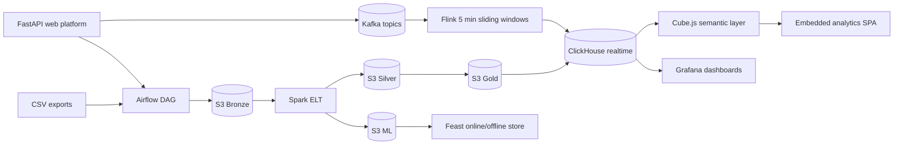

# Architecture

```mermaid
flowchart LR
  API[FastAPI web platform] --> Kafka[(Kafka topics)]
  CSV[CSV exports] --> Airflow[Airflow DAG]
  API --> Airflow
  Airflow --> Bronze[(S3 Bronze)] --> Spark[Spark ELT] --> Silver[(S3 Silver)] --> Gold[(S3 Gold)]
  Spark --> ML[(S3 ML)] --> Feast[Feast online/offline store]
  Kafka --> Flink[Flink 5 min sliding windows] --> ClickHouse[(ClickHouse realtime)]
  Gold --> ClickHouse --> Cube[Cube.js semantic layer] --> SPA[Embedded analytics SPA]
  ClickHouse --> Grafana[Grafana dashboards]
```
