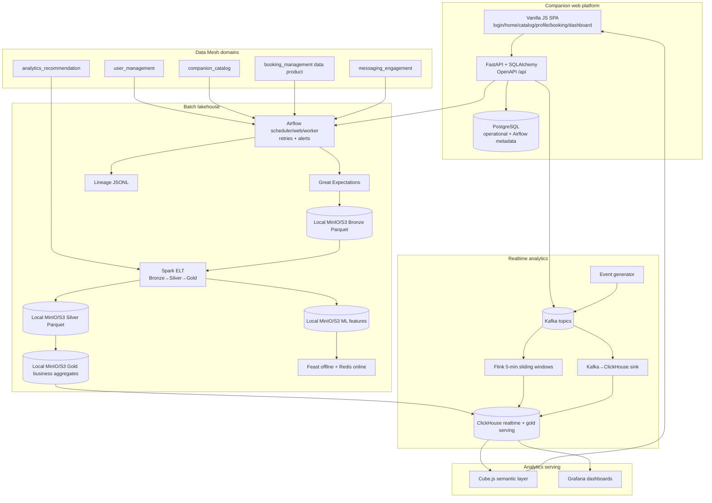

# Final local-first production architecture

```mermaid
flowchart TB
  subgraph Product[Companion web platform]
    SPA[Vanilla JS SPA\nlogin/home/catalog/profile/booking/dashboard]
    API[FastAPI + SQLAlchemy\nOpenAPI /api]
    PG[(PostgreSQL\noperational + Airflow metadata)]
  end

  subgraph DataMesh[Data Mesh domains]
    UM[user_management]
    CC[companion_catalog]
    BM[booking_management data product]
    ME[messaging_engagement]
    AR[analytics_recommendation]
  end

  subgraph Batch[Batch lakehouse]
    Airflow[Airflow scheduler/web/worker\nretries + alerts]
    GE[Great Expectations]
    Lineage[Lineage JSONL]
    Bronze[(Local MinIO/S3 Bronze Parquet)]
    Silver[(Local MinIO/S3 Silver Parquet)]
    Gold[(Local MinIO/S3 Gold business aggregates)]
    ML[(Local MinIO/S3 ML features)]
    Spark[Spark ELT\nBronze→Silver→Gold]
    Feast[Feast offline + Redis online]
  end

  subgraph Streaming[Realtime analytics]
    Kafka[(Kafka topics)]
    Generator[Event generator]
    Flink[Flink 5-min sliding windows]
    Sink[Kafka→ClickHouse sink]
    CH[(ClickHouse realtime + gold serving)]
  end

  subgraph Analytics[Analytics serving]
    Cube[Cube.js semantic layer]
    Grafana[Grafana dashboards]
  end

  SPA --> API --> PG
  API --> Kafka
  Generator --> Kafka
  API --> Airflow
  UM --> Airflow
  CC --> Airflow
  BM --> Airflow
  ME --> Airflow
  AR --> Spark
  Airflow --> GE --> Bronze
  Airflow --> Lineage
  Bronze --> Spark --> Silver --> Gold --> CH
  Spark --> ML --> Feast
  Kafka --> Flink --> CH
  Kafka --> Sink --> CH
  CH --> Cube --> SPA
  CH --> Grafana
```
